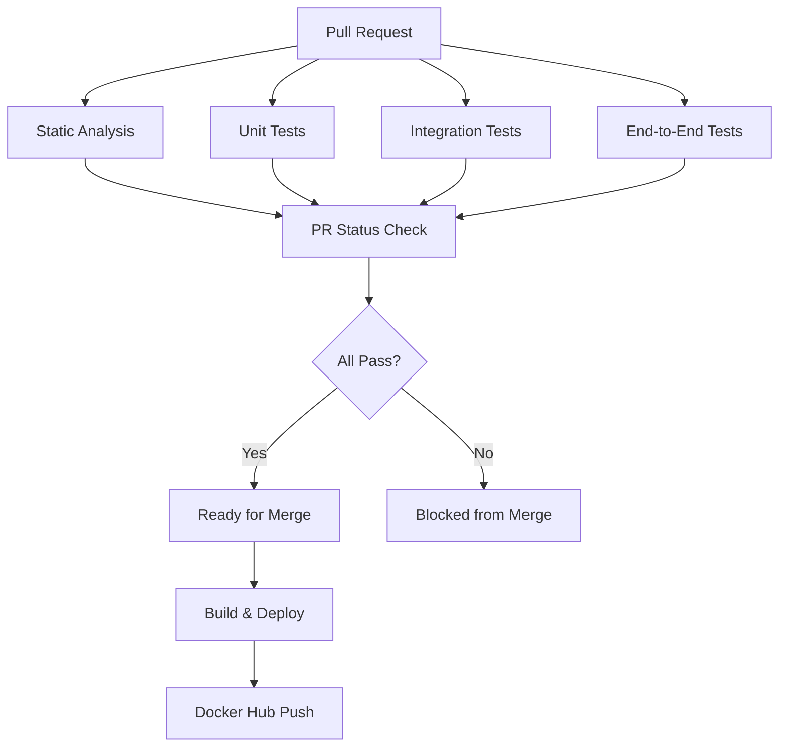

# Page Tracker Application

A simple Flask web application that tracks page views using Redis, demonstrating Docker-based CI/CD practices with comprehensive testing and code quality checks.

## 🚀 Quick Start

### Prerequisites
- Docker and Docker Compose installed
- Git (for development)

### Running the Application

**Option 1: Using Make (Recommended)**
```bash
# Start the application
make up

# View in browser
open http://localhost:80

# Stop the application
make down
```

**Option 2: Using Docker Compose directly**
```bash
# Start the application
docker compose up --build

# View in browser
open http://localhost:80

# Stop the application
docker compose down
```

## 🛠️ Development

### Setup Development Environment
```bash
# Set up Python virtual environment
make dev-setup

# Or manually:
cd web
python3 -m venv venv
source venv/bin/activate
pip install -e ".[dev]"
```

### Available Make Commands

#### Service Management
- `make up` - Start all services (web + redis)
- `make down` - Stop all services
- `make build` - Build Docker images
- `make logs` - Show service logs
- `make restart` - Restart all services
- `make status` - Show service status
- `make health` - Check if services are healthy

#### Testing
- `make test-unit` - Run unit tests
- `make test-integration` - Run integration tests
- `make test-e2e` - Run end-to-end tests
- `make test-all` - Run all tests
- `make ci-test` - Run tests as they would run in CI

#### Code Quality
- `make lint` - Run flake8 linting
- `make black` - Format code with black
- `make isort` - Sort imports with isort
- `make pylint` - Run pylint analysis
- `make bandit` - Run security analysis
- `make format` - Format code (black + isort)
- `make check` - Run all code quality checks

#### Utilities
- `make clean` - Clean up Docker resources
- `make help` - Show all available commands

### Development Workflow

1. **Start development:**
   ```bash
   make up
   make logs  # In another terminal
   ```

2. **Make changes to code**

3. **Run tests:**
   ```bash
   make test-unit
   make test-integration
   ```

4. **Format and check code:**
   ```bash
   make format
   make check
   ```

5. **Run full test suite:**
   ```bash
   make test-all
   ```

## 🏗️ Architecture

The application consists of:

- **Web Service**: Flask application running on port 8000 (mapped to port 80)
- **Redis Service**: Redis database for storing page view counts
- **Test Service**: Dedicated container for running end-to-end tests

### Service Communication
- Web service connects to Redis via `redis://redis-service:6379`
- Services communicate through a custom Docker network
- Redis data is persisted using Docker volumes

## 🧪 Testing Strategy

### Test Types
1. **Unit Tests** (`tests/unit/`): Test individual functions with mocked dependencies
2. **Integration Tests** (`tests/integration/`): Test Flask app with real Redis client
3. **End-to-End Tests** (`tests/e2e/`): Full system tests across containers

### Running Tests
```bash
# Individual test types
make test-unit
make test-integration
make test-e2e

# All tests
make test-all

# CI-style testing
make ci-test
```

## 🔧 Code Quality

The project enforces high code quality standards:

- **Black**: Code formatting
- **isort**: Import sorting
- **flake8**: Linting and style checking
- **pylint**: Code analysis
- **bandit**: Security analysis

### Pre-commit Checks
```bash
make format  # Format code
make check   # Run all quality checks
```

## 🚀 CI/CD Pipeline

### GitHub Actions Workflow
The CI/CD pipeline automatically runs on every push and pull request:

#### **On Pull Request:**
1. **Static Code Analysis** - Comprehensive code quality checks:
   - `flake8` - Linting and style checking
   - `black` - Code formatting validation
   - `isort` - Import sorting validation
   - `pylint` - Code analysis (minimum score: 8.0/10)
   - `bandit` - Security vulnerability scanning

2. **Unit Tests** - Individual component testing:
   - Runs all unit tests with coverage reporting
   - Generates coverage reports (HTML + XML)
   - Uploads coverage to Codecov

3. **Integration Tests** - Component interaction testing:
   - Tests Flask app with real Redis service
   - Uses GitHub Actions Redis service
   - Validates Redis connectivity and operations

4. **End-to-End Tests** - Full system testing:
   - Complete Docker Compose environment
   - Tests entire application stack
   - Validates HTTP endpoints and Redis integration

#### **On Merge to Main:**
- **Build and Deploy** - Production deployment:
  - Builds optimized Docker image
  - Pushes to Docker Hub with tags:
    - `username/page-tracker:latest`
    - `username/page-tracker:commit-sha`
  - Uses GitHub Actions cache for faster builds

### Branch Protection Rules
The `main` branch is protected with the following rules:
- ✅ All CI checks must pass before merge
- ✅ At least 1 code review required
- ✅ Branches must be up to date
- ✅ Conversation resolution required
- ✅ Linear history enforced

### Local CI Testing
```bash
make ci-test  # Run the same tests as CI
make check    # Run all static analysis checks
make test-all # Run all test types
make coverage # Generate coverage reports
```

### CI Job Dependencies


## 📁 Project Structure

```
page-tracker/
├── docker-compose.yml          # Service orchestration
├── Makefile                    # Development commands
├── README.md                   # This file
└── web/
    ├── Dockerfile              # Production image
    ├── Dockerfile.dev          # Development image
    ├── pyproject.toml          # Python dependencies
    ├── constraints.txt         # Dependency versions
    ├── src/
    │   └── page_tracker/
    │       ├── __init__.py
    │       └── app.py          # Main Flask application
    └── tests/
        ├── conftest.py         # Test configuration
        ├── unit/               # Unit tests
        ├── integration/        # Integration tests
        └── e2e/                # End-to-end tests
```

## 🐛 Troubleshooting

### Common Issues

**Port 80 already in use:**
```bash
# Check what's using port 80
lsof -i :80
# Stop the conflicting service or change the port in docker-compose.yml
```

**Docker build fails:**
```bash
# Clean up and rebuild
make clean
make build
```

**Tests failing:**
```bash
# Run tests individually to isolate issues
make test-unit
make test-integration
make test-e2e
```

**Redis connection issues:**
```bash
# Check if Redis is running
make status
# Check Redis logs
docker compose logs redis-service
```

### Getting Help
```bash
make help  # Show all available commands
```

## 🤝 Contributing

1. Create a feature branch
2. Make your changes
3. Run tests and quality checks:
   ```bash
   make test-all
   make check
   ```
4. Create a pull request
5. Ensure CI passes
6. Get approval and merge

## 📝 License

This project is part of a Docker CI/CD demonstration.
